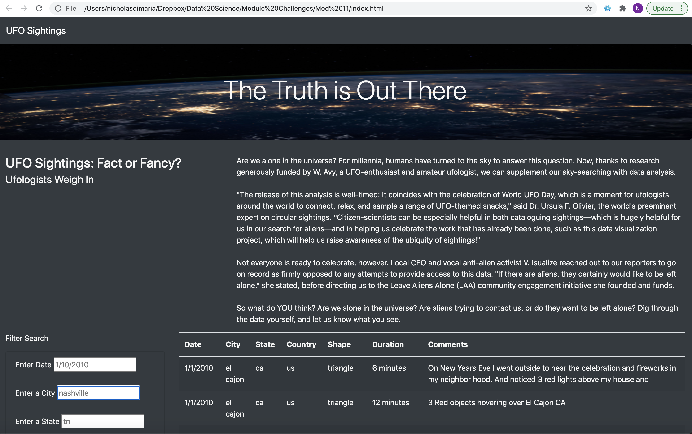
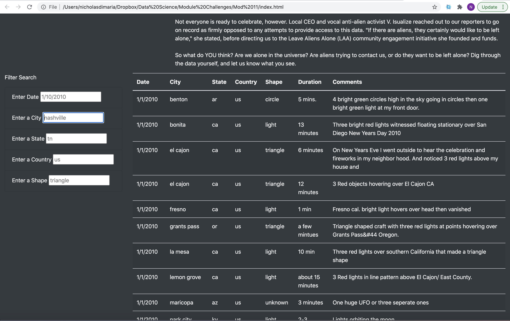

# UFOs

## Overview

This website began as a table with with the ability to filter UFO sightings by date. In this challenge, we added filters for city, state, country, and the shape of the object seen and published the site to Github pages to share.

## Results

The site opens with the full table of all UFO sightings from the data we have. From here we can easily filter this table according to the five criteria listed above. Take note of the format given in the preview for each filter field.

Enter the value you want to filter according to the format and push enter on your keyboard. You do not need to enter a value in every field in order to filter the data.

Results should display in the same table format filtered in the criteria entered!

## Summary

There are some potential limitations to this setup as it stands now. First, we have not cleaned this data set. There could be misspellings or typos that could effect what would show up in a particular search result. 
